# Modelling 2

In the last docs we learned about simulation and why it's important, took a quick look on gazebo and how do we deal with it, learned about sdf and it's different tags and finally created our own robot from scratch. In this file we will continue our journey in modelling, so let's start by listing the goals that we want to achieve by the end of this file:

1. Moving robot.
2. World design.
3. Adding sensors
4. GZ Sim topics.
5. ROS2 bridge.

Quick recap of the previous docs we have created a robot with a cylinderical chassis, two revolute wheels and one caster wheel on bottom front of the robot. We have added all the joints for those links and conneced everything together. Now let's start moving this robot around.

---

### Moving robot

When we think of moving the robot we think of motors since it's the main part that causes movement in most hardwares but how can we add a motor to our robot, do we have to create a link for it and connect it with the wheels using joints.

Actually here comes the third building block of our model to provide us with the answer which is plugins.

Think of plugins as libraries that has some code built in it that we can call and use in our environment. So we are going to use a plugin to enable our robot to move in the environment and this plugin is called Diff_drive plugin.

Let's take a look on how this plugin looks like and try to understand its attributes and parameters.

##### Diff_drive plugin

```xml
<plugin
    filename="libignition-gazebo-diff-drive-system.so"
    name="ignition::gazebo::systems::DiffDrive">
    <left_joint>left_wheel_joint</left_joint>
    <right_joint>right_wheel_joint</right_joint>
    <wheel_separation>0.6</wheel_separation>
    <wheel_radius>0.15</wheel_radius>
    <odom_publish_frequency>1</odom_publish_frequency>
    <topic>cmd_vel</topic>
</plugin>
```

Any plugin we add in sdf has two attributes:

* filename: which takes the library file name
* name takes the name of the plugin

We notice here that this plugin have six main tags that we have to fill

* left_joint and right_joint: take the left and right joints of the wheels that we have created
* wheel_seperation: takes the distance between the left and right wheel (in our case the left wheel is located at -0.3 and the right wheel at 0.3 in the y-axis so the distance between them is 0.6)
* wheel_raduis: takes the wheel raduis that we have set to 0.15 in the wheel link
* odom_publish_frequency: Sets the rate that the odom will be published at
* topic: sets the name of the topic that we can control the robot through

Now that we have understood the plugin let's add it to our robot inside the model tag and try to move the robot.

```bash
ign gazebo building_robot.sdf

ign topic -t "/cmd_vel" -m ignition.msgs.Twist -p "linear: {x: 0.5}, angular: {z: 0.05}"
```

Let's understand these commands first:

* The first command as we said before launchs gazebo and opens our model
* Second command just like ROS gazebo has its own topics so here we run `ign topic` to specify that we are using gazebo topics
  * -t: takes the topic name that we are going to call
  * -m: takes the message type that this topic accepts
  * -p: takes the message content that we want to pass

Now let's take a look on what is this command is actually doing.

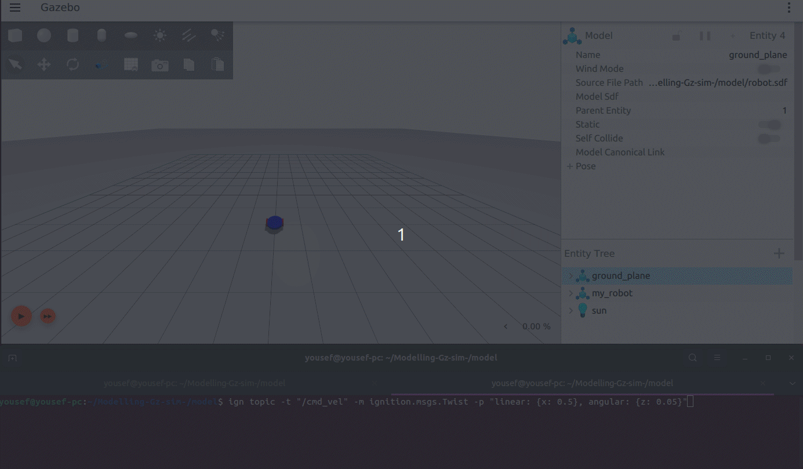

We see here that our robot is moving fine and the plugin is working just right.

> Notice that weird vibration that the robot did at the start of its movement that's because we have added a caster wheel in the front and revolute wheels on the side so the back is not supported. We can fix this by adding another caster wheel on the back or by moving the revolute wheels backwards a little so it won't be on the center of the robot, but we will leave it like that for now

Now how about we control the robot movement and move it wherever we want like we did with turtlesim before using turtle_teleop_key. To do that we will use two more plugins KeyPublisher and TriggerPublisher.

##### KeyPublisher

is a gui plugin that we can start from gazebo directly without needing to add it manually in the description file.

What this plugin does is it reads the keystrokes we trigger when we press on the keyboard and sends them on a default topic calles /keyboard/keypress.

We want to get these values from the topic and depending on the retreived value we pass a twist message to the cmd_vel that we have created.

Didn't understand very well, that's fine let's take it step by step. We will start by choosing the keys that we want to control the robot through.

Let's say i want to control the robot through w,a,s,d and f

* w: move forward
* a: rotate left
* s: move backward
* d: rotate right
* f: stop the robot

Now we need to get the data that each key presents on the keyboard. Meaning that when you press a for example gazebo doesn't read it a but instead it reads it as a value so we want to get this value and we will do this by running the KeyPublisher plugin and running this command while we are running our model:

```bash
ign topic -e -t /keyboard/keypress
```

Let's see how we would do that:

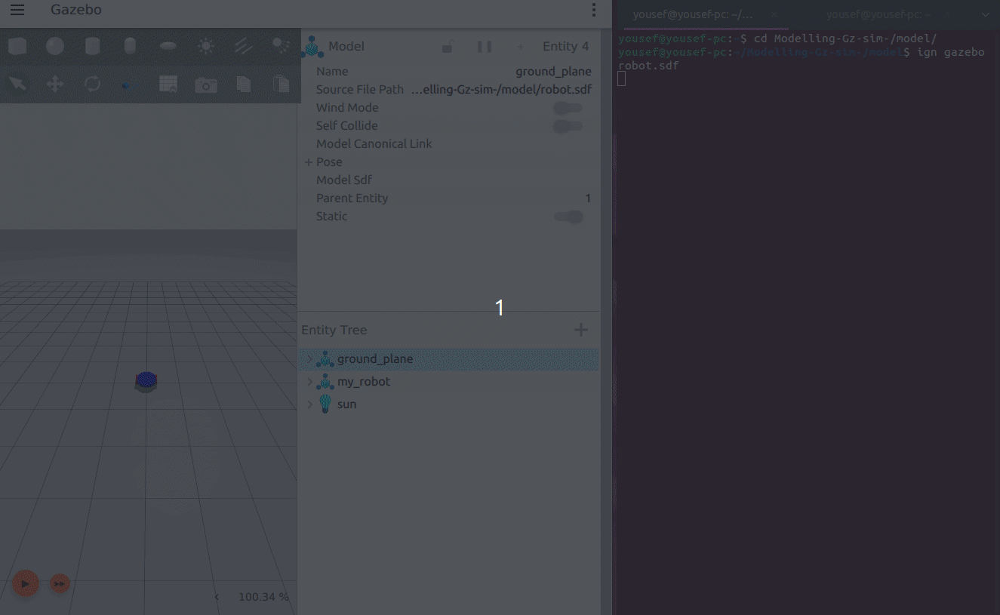

We started our sdf file, and in another terminal we add the command which prints the message being sent on the /keyboard/keypress topic. Then we started the KeyPublisher plugin which publishes the data of the key when we press it. Finally we pressed the keys in this order (w,a,s,d,f). Now that we know the data that each key presents we can move to the next step which is adding the TriggerPublisher plugin in our model.

##### TriggerPublisher

```xml
<plugin filename="libignition-gazebo-triggered-publisher-system.so"
        name="ignition::gazebo::systems::TriggeredPublisher">
    <input type="ignition.msgs.Int32" topic="/keyboard/keypress">
        <match field="data">87</match>
    </input>
    <output type="ignition.msgs.Twist" topic="/cmd_vel">
        linear: {x: 0.5}, angular: {z: 0.0}
    </output>
</plugin>
```

All this plugin does is publish a specific output on a topic when it receives a specific input.

So in our case we specified the input topic to be /keyboard/keypress and we read the input and see if it is equal to 87 which is the data representing the letter w, if it matches it we publish this message linear: {x: 0.5}, angular: {z: 0.0} on the /cmd_vel topic which moves the robot forward.

Now we need to duplicate this plugin for each letter we want so it in the end it will look like this.

```xml
<plugin filename="libignition-gazebo-triggered-publisher-system.so"
        name="ignition::gazebo::systems::TriggeredPublisher">
    <input type="ignition.msgs.Int32" topic="/keyboard/keypress">
        <match field="data">87</match>
    </input>
    <output type="ignition.msgs.Twist" topic="/cmd_vel">
        linear: {x: 0.5}, angular: {z: 0.0}
    </output>
</plugin>
<plugin filename="libignition-gazebo-triggered-publisher-system.so"
        name="ignition::gazebo::systems::TriggeredPublisher">
    <input type="ignition.msgs.Int32" topic="/keyboard/keypress">
        <match field="data">65</match>
    </input>
    <output type="ignition.msgs.Twist" topic="/cmd_vel">
        linear: {x: 0.0}, angular: {z: 0.5}
    </output>
</plugin>
<plugin filename="libignition-gazebo-triggered-publisher-system.so"
        name="ignition::gazebo::systems::TriggeredPublisher">
    <input type="ignition.msgs.Int32" topic="/keyboard/keypress">
        <match field="data">83</match>
    </input>
    <output type="ignition.msgs.Twist" topic="/cmd_vel">
        linear: {x: -0.5}, angular: {z: 0.0}
    </output>
</plugin>
<plugin filename="libignition-gazebo-triggered-publisher-system.so"
        name="ignition::gazebo::systems::TriggeredPublisher">
    <input type="ignition.msgs.Int32" topic="/keyboard/keypress">
        <match field="data">68</match>
    </input>
    <output type="ignition.msgs.Twist" topic="/cmd_vel">
        linear: {x: 0.0}, angular: {z: -0.5}
    </output>
</plugin>
<plugin filename="libignition-gazebo-triggered-publisher-system.so"
        name="ignition::gazebo::systems::TriggeredPublisher">
    <input type="ignition.msgs.Int32" topic="/keyboard/keypress">
        <match field="data">70</match>
    </input>
    <output type="ignition.msgs.Twist" topic="/cmd_vel">
        linear: {x: 0.0}, angular: {z: 0.0}
    </output>
</plugin>
```

We called the plugin five times one for each key we want and we can add as much keys as we like and make any key do what ever we want as long as we have grasped the concept of these two plugins. Now let's see these plugins in action.

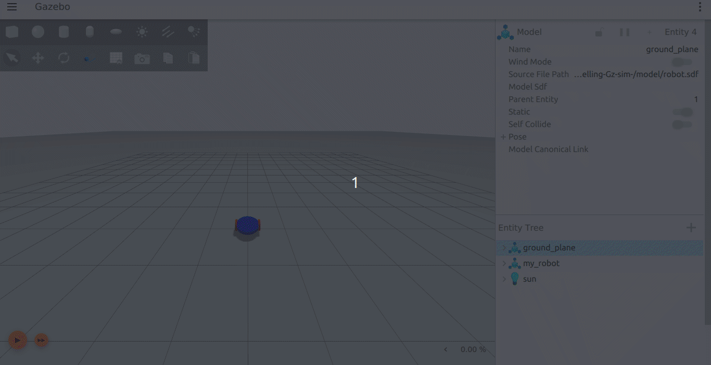

As you can see now all we have to do is to start the KeyPublisher plugin and we can control the robot using the keys that we have setup.

And with that we have successfully enabled our robot to move. It's now time to create a map that this robot can navigate.

### World design

Let's create our world, for this project we will create a house like environment that fits our robot.

Here is the environment that we are going to create as you can see it consists of several walls with different length.

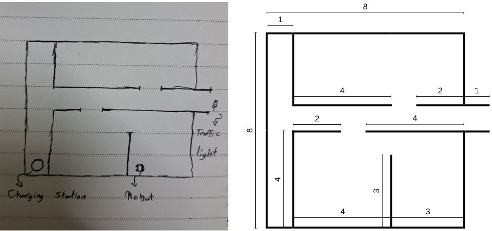

Let's learn a new trick to save us sometime since as we can see our house consists of more than 10 walls and they are just the same thing with different length and repeated in different locations and orientations.

So we will create one wall of each length (1,2,3,4,8) and use them as building blocks in our main file.

we will start by navigating to the model folder and create a folder to contain our components and create a file for each wall.

##### creating wall

```bash
mkdir walls

cd walls

touch 1.sdf 2.sdf 3.sdf 4.sdf 8.sdf
```

Now that we have created the files let's start by descriping the first file which is the 1-meter wall.

```xml
<?xml version="1.0" ?>
<sdf version="1.9">
  <model name="wall">
  <static>true</static>
    <link name="wall_link">
      <collision name="collision">
        <geometry>
          <box>
            <size>1.0 0.1 1.5</size> 
          </box>
        </geometry>
      </collision>

      <visual name="visual">
        <geometry>
          <box>
            <size>1.0 0.1 1.5</size>
          </box>
        </geometry>
        <material>
          <ambient>0.4 0.2 0.7 1</ambient>
          <diffuse>0.4 0.2 0.7 1</diffuse>
          <specular>0.4 0.2 0.7 1</specular>
        </material>
      </visual>

      <inertial>
        <mass>10.0</mass> 
        <inertia>
          <ixx>0.1</ixx>
          <iyy>0.1</iyy>
          <izz>0.1</izz>
        </inertia>
      </inertial>
    </link>
  </model>
</sdf>
```

As we can see it's a simple model with a static tag to prevent it from falling when the robot hits it.

Now let's create the remaining models with the same parameters except the size in the x-axis in the collision and visual.

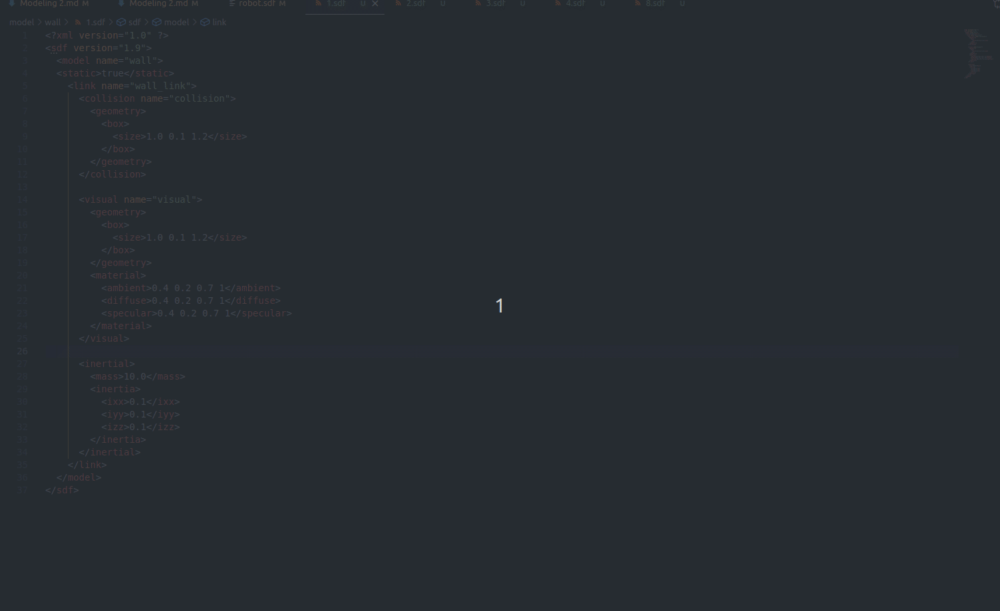

Now all we have to do is to spawn the walls in the world and locate them in the right position, and we will do that bu using the include tag.

In our main file inside the world tag we will add the iclude tag, and here how it looks.

```xml
<include>
    <uri>./wall/1.sdf</uri>
    <name>first_wall</name>
    <pose>0 -3 0.6 0 0 0</pose>
</include>
```

first we add the path to our wall file in the uri element, then we give it a unique name since we will be instancing many walls of the same file. Finally we specify the pose that we want our model to spawn at.

> Since our wall is 1.2 meters tall so if we want the wall to be completely above the ground we should set it's center to 0.6 in the z-axis

Let's see what it looks like after we add this wall.

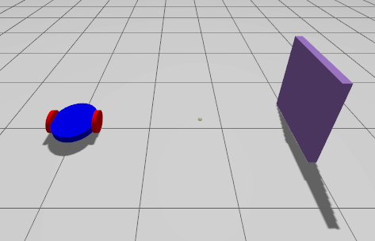

We got it working fine so let's place all the walls and see what the final result will look like.

##### Building house

Here is the location of each wall if you want to try it for yourself before looking at the code. The rotated icon means that this wall is rotated around the z-axis by 90 degrees.

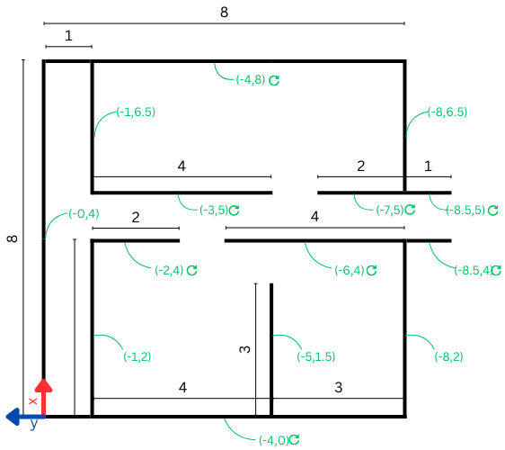

After adding all the walls it will look like this:

```xml
<include>
    <uri>./wall/8.sdf</uri>
    <name>wall_1</name>
    <pose>0 -4 0.6 0 0 -1.5707</pose>
</include>
<include>
    <uri>./wall/8.sdf</uri>
    <name>wall_2</name>
    <pose>4 0 0.6 0 0 0</pose>
</include>
<include>
    <uri>./wall/8.sdf</uri>
    <name>wall_3</name>
    <pose>8 -4 0.6 0 0 1.5707</pose>
</include>
<include>
    <uri>./wall/4.sdf</uri>
    <name>wall_4</name>
    <pose>5 -3 0.6 0 0 1.5707</pose>
</include>
<include>
    <uri>./wall/4.sdf</uri>
    <name>wall_5</name>
    <pose>2 -1 0.6 0 0 0</pose>
</include>
<include>
    <uri>./wall/4.sdf</uri>
    <name>wall_6</name>
    <pose>2 -8 0.6 0 0 0</pose>
</include>
<include>
    <uri>./wall/4.sdf</uri>
    <name>wall_7</name>
    <pose>4 -6 0.6 0 0 1.5707</pose>
</include>
<include>
    <uri>./wall/3.sdf</uri>
    <name>wall_8</name>
    <pose>1.5 -5 0.6 0 0 0</pose>
</include>
<include>
    <uri>./wall/3.sdf</uri>
    <name>wall_9</name>
    <pose>6.5 -1 0.6 0 0 0</pose>
</include>
<include>
    <uri>./wall/3.sdf</uri>
    <name>wall_10</name>
    <pose>6.5 -8 0.6 0 0 0</pose>
</include>
<include>
    <uri>./wall/2.sdf</uri>
    <name>wall_11</name>
    <pose>4 -2 0.6 0 0 1.5707</pose>
</include>
<include>
    <uri>./wall/2.sdf</uri>
    <name>wall_12</name>
    <pose>5 -7 0.6 0 0 1.5707</pose>
</include>
<include>
    <uri>./wall/1.sdf</uri>
    <name>wall_13</name>
    <pose>4 -8.5 0.6 0 0 1.5707</pose>
</include>
<include>
    <uri>./wall/1.sdf</uri>
    <name>wall_14</name>
    <pose>5 -8.5 0.6 0 0 1.5707</pose>
</include>
```

And when we run the simulation it will look like this

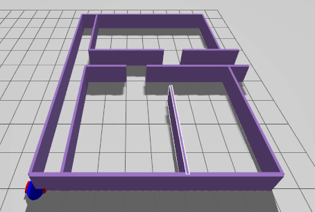

Notice that the wall intersects with our robot so we need to move the robot by changing its pose.

Let's set it to (1,-6), so that it'll be inside our house `<pose relative_to='world'>1 -6 0 0 0 0 </pose>`

Now we have successfully setup our world and placed our robot inside the house, let's move on to the next step which is adding some senors to the robot.

### Adding sensors

In this part we will three sensors (Imu, Lidar, Camera), there is a lot of sensors that gazebo offers for us but we will just use these for now.

To add a sensor to our model we will use the plugin tag which we have introduced a while ago when we were moving the robot. So let's start with the first sensor.

#### IMU

The Imu is a very important sensor when it comes to autonomus systems since it provides us with valuable informations about our robot:

* Orientation
* Angular velocity
* Linear acceleration

So to add the Imu sensor to our model first of all we should add the plugin inside the world tag, here it is:

```xml
<plugin filename="libignition-gazebo-imu-system.so"
    name="ignition::gazebo::systems::Imu">
</plugin>
```

As we said before we just specify the filename and the name of the plugin and we are good to go.

We have declared in our file that we will use an Imu. The next step is to attach the Imu sensor itself to our robot, and we will do this by using the sensor tag:

We can add the imu sensor to any link in our model, let's use the chassis since it's in the center of the robot. Inside the chassis tag add this code:

```xml
<sensor name="imu_sensor"type="imu">
    <always_on>1</always_on>
    <update_rate>1</update_rate>
    <visualize>true</visualize>
    <topic>imu</topic>
</sensor>
```

Let's understand the code that we have added:

* always_on: means that the sensor is updating according to the update rate and is not turned off.
* update_rate: defines the frequency that the sensor will send data based on.
* visualize: means that the Imu will be visible and displayed in the gui in gazebo.
* topic: the name of the topic that the imu will publish data on.

Now the Imu should be up and ready so let's see if it's working.

Let's start our model and in another terminal window we will run this command.

```bash
ign topic -e -t /imu
```

This commands echos the topic named /imu that we have just defined.

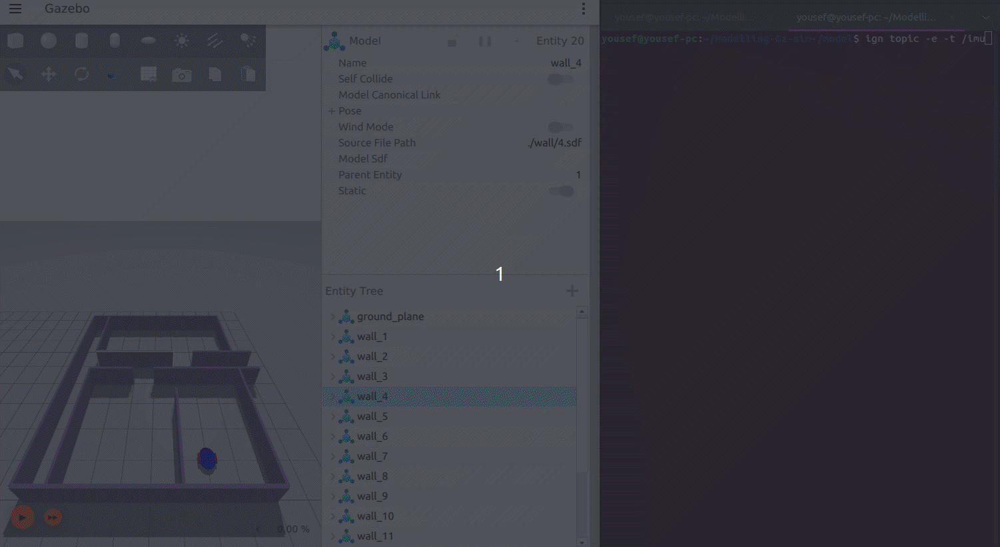

As we can see the Imu is working fine and provides us with the data we need.

> The weird noisy data when we first started the Imu is not errors, it's just a very small numbers that are basically equals zero, look at the end of the numbers you will see that it has a high negative power (-7,-12,-17). So don't be concerned by these values.

Now that we have successfully added the imu to our robot let's add the next sensor Lidar.

#### LIDAR

Before we add the lidar itself to our robot let's see a small problem that we are going to have.

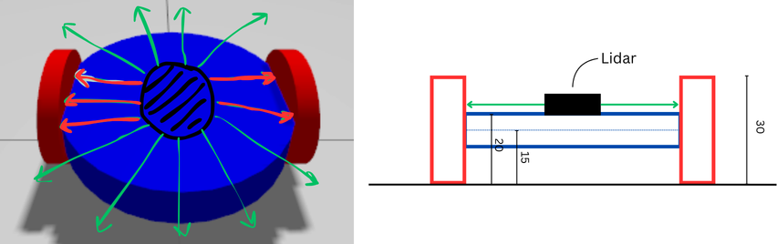

As we can see from this image since our wheels is higher than the chassis some lidar beams will hit the wheel and not go through which will lead us to faulty lidar data.

So we can fix this by creating a platform above our chassis that hold the lidar preventing this from happening.

##### Creating platform

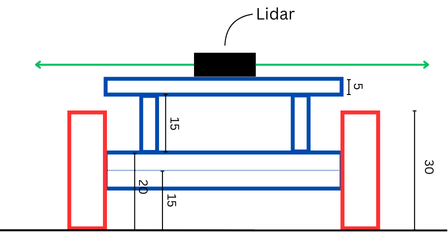