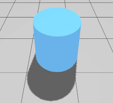

# Modelling 1

In this documentation we will learn about modelling and how can we build a robot and a world to test our system in.

First of all we need to choose a simulator to build our environment in. There are several simulators that support ROS2 that we can use each one has its pros and cons and is suitable for certain applications.

Secondly we will need to learn about the format or the language that we will use to write the robot description or if there is a tool to help us in this regard.

Lastly is controlling the robot that we had made in this simulator and validating the output that we see in a certain way.

So after we have defined what are the various aspects of the modelling task let's list the steps that we are going to take to achieve this task:

1. What is simulations and why it's important?
2. Simulators comparison and use cases.
3. GZ Sim
4. SDF format.
5. Building robot.

We will go through this list one by one till we fully understand how the simulation works and integrate our system in it.

---

### What is simulations and why it's important?

Simulation refers to using virtual environment that looks and acts as the real world to test and analyze our systems before and after deployment. In robotics and autonomous applications simulation plays a crusial rule in the different phases of development.

Let's imagine a scenario where we are building a robot that navigates in a home and it's designed to get to a goal location that we are going to input without any prior knowledge in the environment.

before we start building the robot in the real world firstly we have to design the robot and test it in the simulation and fix any arising errors this type of simulation is called dynamic simulation as we simulate the real-workd physics such as gravity and friction. and after we make sure that our robot is working fine and the system is performing as expected we will need to simulate the sensors that will be mounted on our robot and make sure they are compatable. Even after building the robot in the real world simulation still plays a very important role in improving the robot and adding extra features.

So to sum up, simulation in robotics provides us with a cost effective solutions to develop and test our system before deployment also we can simulate difficult and inaccessible environments the we as humans can't reach. so overall simulation is a very important step in development. so let's take a deep dive in our first stops of the simulation train.

---

### Simulators comparison and use cases

Now let's take a look at the different simlators and their use cases.

| **Simulator**           | **Best For**                      | **Physics Engine**   | **Sensor Simulation**   | **ROS Support** | **AI & ML Integration** | **Real-Time Capable** | **GPU Acceleration** | **Ease of Use** |
| :---------------------------- | --------------------------------------- | :------------------------- | ----------------------------- | --------------------- | ----------------------------- | --------------------------- | -------------------------- | --------------------- |
| **Gazebo (Ignition)**   | General robotics, ROS-based robots      | ODE, Bullet, DART, Simbody | ✅ (LIDAR, cameras, IMU)      | ✅ (ROS 1 & 2)        | ⚠️ Limited                  | ✅                          | ⚠️ Limited               | Medium                |
| **Webots**              | Educational & industrial robotics       | ODE                        | ✅ (Cameras, GPS, IMU, LIDAR) | ✅ (ROS 1 & 2)        | ⚠️ Limited                  | ✅                          | ❌                         | High                  |
| **CoppeliaSim (V-REP)** | Robotic manipulators, industrial robots | Bullet, ODE, Vortex        | ✅                            | ✅ (ROS 1 & 2)        | ✅ (Reinforcement Learning)   | ✅                          | ❌                         | Medium                |
| **CARLA**               | Autonomous vehicles, ADAS               | Unreal Engine physics      | ✅ (LIDAR, cameras, radar)    | ✅ (ROS Bridge)       | ✅ (Deep Learning)            | ⚠️ Partial                | ✅ (CUDA, RTX)             | Medium                |
| **LGSVL Simulator**     | Autonomous driving, ADAS                | Unity physics              | ✅ (LIDAR, cameras, radar)    | ✅ (Apollo, ROS)      | ✅ (AI Training)              | ✅                          | ✅ (NVIDIA GPU)            | Medium                |
| **NVIDIA Isaac Sim**    | Robotics AI, digital twins              | PhysX                      | ✅ (High-fidelity sensors)    | ✅ (ROS 1 & 2)        | ✅ (Deep Learning, RL)        | ✅                          | ✅ (RTX, Omniverse)        | Low (Complex)         |
| **PyBullet**            | AI, Reinforcement Learning (RL)         | Bullet                     | ❌                            | ❌                    | ✅ (RL & Physics-based AI)    | ✅                          | ✅ (GPU Support)           | Medium                |
| **MuJoCo**              | Biomechanics, AI research               | Custom physics             | ❌                            | ❌                    | ✅ (RL & AI Training)         | ✅                          | ✅ (GPU for acceleration)  | Medium                |
| **AirSim**              | Drones, autonomous flight               | Unreal Engine physics      | ✅ (Depth, LIDAR, GPS, IMU)   | ✅ (ROS Bridge)       | ✅ (Deep Learning, RL)        | ✅                          | ✅ (CUDA, RTX)             | Medium                |

As we can see from this table there are a lot of simulators and there are more that were not included each one excells in some aspects making it suitble for certain applications.

Since we are using ROS2 and we are looking for a simulator for general purpose tasks we will use gazebo which is refered to as (gz sim).

---

### GZ Sim

GZ Sim formerly known as gazebo is an open-source simulation tool for robotics and autonomous systems. it provides us with:

* physics simulation
* sensor modeling
* ROS integration

Gazebo is one of the most if not the most used simulators with ROS. Previously when you install ROS1 gazebo is installed with it by default so they are a good match to use them together.

Gazebo was developed in 2002 by Andrew Howard and was initially just a 2d physics engine but as the years went by it became an open source 3d simulator.

Gazebo officially transitioned to ignition gazebo in 2022 and it was renamed to GZ Sim.

Since we have decided to continue with gazebo the first step is installing the program on our machine.

#### Installation

Before we install gazebo we should choose the right version that fits our ROS2 version. here is the table for the different versions:

|                              | **GZ Citadel (LTS)** | **GZ Fortress (LTS)** | **GZ Harmonic (LTS)** | **Gz Ionic** |
| ---------------------------- | -------------------------- | --------------------------- | --------------------------- | ------------------ |
| **ROS 2 Rolling**      | ❌                         | ❌                          | ⚡                          | ✅                 |
| **ROS 2 Jazzy (LTS)**  | ❌                         | ❌                          | ✅                          | ❌                 |
| **ROS 2 Humble (LTS)** | ❌                         | ✅                          | ⚡                          | ❌                 |
| **ROS 1 Noetic (LTS)** | ✅                         | ⚡                          | ❌                          | ❌                 |

* ✅ - Recommended combination
* ❌ - Incompatible / not possible.
* ⚡ - Possible,  *but use with caution* . These combinations of ROS and Gazebo can be made to work together, but some effort is required.

Since we are using ROS2 Humble we are going to download GZ Fortress. Follow these commands to install it:

```bash
sudo apt-get update

sudo apt-get install lsb-release gnupg

sudo curl https://packages.osrfoundation.org/gazebo.gpg --output /usr/share/keyrings/pkgs-osrf-archive-keyring.gpg

echo "deb [arch=$(dpkg --print-architecture) signed-by=/usr/share/keyrings/pkgs-osrf-archive-keyring.gpg] http://packages.osrfoundation.org/gazebo/ubuntu-stable $(lsb_release -cs) main" | sudo tee /etc/apt/sources.list.d/gazebo-stable.list > /dev/null

sudo apt-get update

sudo apt-get install ignition-fortress
```

After you run these commands GZ Fortress should be installed and you can find it in your apps as `ign gazebo`

#### Getting started with gazebo

we can start gazebo either by clicking the icon from the applicaiton list and it will give us this screen.


We can choose any scene we want and click run.

or we can run it directly from terminal using this command:

```bash
ign gazebo
```

This will give us the same page. We also run the scene directly from terminal by providing the sdf file in the command such like this:

```bash
ign gazebo shapes.sdf
```

This is a built in scene that we can use to showcase the different aspects of gazebo. It will look like this:


Now let's analyze the gui that we are seeing

* First we have the toolbar at the top left corner of the screen. We can use this toolbar to add different shapes and light types in the environment. We can also change the scale and rotation of objects using the translation and rotation tools and we can copy and paste objects.
* The right panel which is divided into two sections the component inspector and the entity tree. The component inspector contains information about the physics of the workd such as gravity and magnetic field. and the entity tree contains all the objects in our scene.

> note that any object in our scene is considered an entity and we can expand this entity to see the various components of it.

* The scene which is the main component that we can see which let us visualize the various objects in our environment. and we can control the scene by the play and steps button on the bottom corner of the scene. the play button lets us start and pause the simulation and the steps button lets us step through the simulation at the rate of a step size or one iteration at a time.

If you try to move any object up for example and run the simulation you will notice that it starts falling and hit the floor acting like the real world.


Now that we seen how gazebo works let's start building our environment and we the first step of doing this is by understanding SDF.

---

### SDF format

in the previous example we ran a world called shapes.sdf here we notice the extention of the file which is SDF. This is the format that gazebo uses.

SDFormat (Simulation Description Format) is an XML based format that we use to describe objects and environments for robot simulators.

SDF is originally developed as part of the gazebo simulator. In ROS1 URDF was used instead but as gazebo developed it has developed its unique description language SDF.

There are tools to help you migrate your robot from URDF to SDF if you already work with URDF but since we are still learning we will choose the modern and original solution that gazebo offers and learn SDF directly.

Before we dive into SDF we need to understand what is XML format to begin with.

**Extensible Markup Language** (**XML**) is a markup language and file format for storing, transmitting, and reconstructing data. XML uses a structure that looks a lot like HTML.

XML uses tags or we can call them elements for simplicity. We can arrange, add and merge those elements in a certain way to create our robot. Elements can contain another elements inside them we call them children.

XML does not have predefined tags like HTML instead, users define their own tags to better suit their application.

Since we kinda umderstood what is SDF let's start building our robot.

---

### Building robot

Before building our robot there are three main tags in sdf that we should learn how to use as they will be the building blocks of our robot (Links, Joints, Plugins). Each one of these elements has its own children that we are going to learn about as we go.

Now the first step of building our robot is designing it and knowing what it will look like. Let's say we want to create something similar to this robot. Chassis with two wheels on the sides and caster wheel at the bottom to enable use to rotate 360 while in place.


So what exactly are the components of this robot.

First of all we should think of our robots in terms of links and joints. each element that we see is a link and links connect to each other using joints. So we have the base link (chassis) which is the grey cylinder in the center, and this base link is fixed which means it doesn't move on its own. Then we have the wheels and the wheel link can rotate 360 degrees, and they are located on the center right and center left of the robot. Finally we have the caster wheel which has a free motion and can rotate in all axes but it's fixed in place and can't move, and it's located on the bottom front of the robot. later after we finish the design of our robot we can add a platform to it and add some sensors like Lidar, Camera, and Imu.

So after we have analyzed our model and defined the components of it, let's start creating the model. And the first step is creating a new file and name it whatever you want but make sure that it's .sdf.

```bash
mkdir model
cd model
touch robot.sdf
```

Ok now open the file and add this code to it:

```xml
<?xml version="1.0" ?>
<sdf version="1.8">
    <world name="car_world">
        <physics name="1ms" type="ignored">
            <max_step_size>0.001</max_step_size>
            <real_time_factor>1.0</real_time_factor>
        </physics>
        <plugin
            filename="libignition-gazebo-physics-system.so"
            name="ignition::gazebo::systems::Physics">
        </plugin>
        <plugin
            filename="libignition-gazebo-user-commands-system.so"
            name="ignition::gazebo::systems::UserCommands">
        </plugin>
        <plugin
            filename="libignition-gazebo-scene-broadcaster-system.so"
            name="ignition::gazebo::systems::SceneBroadcaster">
        </plugin>

        <light type="directional" name="sun">
            <cast_shadows>true</cast_shadows>
            <pose>0 0 10 0 0 0</pose>
            <diffuse>0.8 0.8 0.8 1</diffuse>
            <specular>0.2 0.2 0.2 1</specular>
            <attenuation>
                <range>1000</range>
                <constant>0.9</constant>
                <linear>0.01</linear>
                <quadratic>0.001</quadratic>
            </attenuation>
            <direction>-0.5 0.1 -0.9</direction>
        </light>

        <model name="ground_plane">
            <static>true</static>
            <link name="ground">
                <collision name="collision">
                <geometry>
                    <plane>
                    <normal>0 0 1</normal>
                    </plane>
                </geometry>
                </collision>
                <visual name="visual">
                <geometry>
                    <plane>
                    <normal>0 0 1</normal>
                    <size>100 100</size>
                    </plane>
                </geometry>
                <material>
                    <ambient>0.8 0.8 0.8 1</ambient>
                    <diffuse>0.8 0.8 0.8 1</diffuse>
                    <specular>0.8 0.8 0.8 1</specular>
                </material>
                </visual>
            </link>
        </model>
    </world>
</sdf>
```

Now let's take a look at what we have added

* The first line is defining the xml version this line says to any program that the following syntax is XML syntax so it can handle it right, and it's going to be our first line in every model that we are going to create.
* The sdf tag also have the version and it says that we are going to use sdf not any other language that uses XML format. We will add our world in this tag as this is considered the root element.
* We start by defining the world and give it a name in our case we named it "my_world". The world tag will contain all the elements in our world in it.
* Then we have the physics tag which has some features:
  * name: defines a name for the physics engine used
  * type: is the type of the physics engine we want to use, there is multiple options such as Ode, Bullet, Simbody and Dart, but we are going to set it to ignored as we don't want this tag to choose the engine for us yet.
  * max_step_size: this child define the step size of each iteration that the simulation is going to take to perform its calculations. the smaller this value is the more accurate the simulation will be. but it will be more computationally expensive.
  * real_time_factor: is the ratio of the simulation time to the reat time
* After that we have some plugins tags, the physics plugin is for simulating the dynamics of the real world. The UserCommands plugin enables us to create models, and controlling them. And finally the SceneBroadcaster plugin shows the world scene in gazebo
* Then we have the light tag which let's us add light to our scene. the important children for this tag is:
  * pose: which lets us define the position of our light and we will see how to do this later.
  * direction: which we use to define the direction of the casted light so we can direct it to our model.
  * The rest of the children are related to the light itself so we can control its intensity, color, fading, etc
* Finally the model tag let us define the models that we want to add to our world.

Before we dive into the model tag and start creating our mode let's take a look at what this code looks like in gazebo by running this command:

```bash
ign gazebo robot.sdf 
```

this will open gazebo and give us the world that we have created and it will look like this:


Notice here that we have all the elements that have encountered before (toolbar, entity tree, component inspector). That's because we used the default gui of gazebo. Gazebo lets us customize the gui to our liking we can remove components and add components as we want.

We can customize the gui using the gui tag which goes inside the world tag. Inside the gui tag we can define the plugins that we want to be displayed on the screen. Here is an example of the gui tag.

```xml
<gui fullscreen="0">
    <plugin filename="MinimalScene" name="3D View">
    <gz-gui>
        <title>3D View</title>
        <property type="bool" key="showTitleBar">false</property>
        <property type="string" key="state">docked</property>
    </gz-gui>

    <engine>ogre2</engine>
    <scene>scene</scene>
    <ambient_light>0.4 0.4 0.4</ambient_light>
    <background_color>0.8 0.8 0.8</background_color>
    <camera_pose>-6 0 6 0 0.5 0</camera_pose>
    <camera_clip>
        <near>0.25</near>
        <far>25000</far>
    </camera_clip>
    </plugin>
    <plugin filename="GzSceneManager" name="Scene Manager">
    <gz-gui>
        <property key="resizable" type="bool">false</property>
        <property key="width" type="double">5</property>
        <property key="height" type="double">5</property>
        <property key="state" type="string">floating</property>
        <property key="showTitleBar" type="bool">false</property>
    </gz-gui>
    </plugin>
</gui>
```

In this example we are using only two plugins the minimal scene which only shows the toolbar and the scene manager which displays the panel on the right side of the screen.

Notice that we can modify the looks and position of these plugins by defining children such as width and height, we can define the background color and control the state of the plugin if it's docked in place or floating.

If we try to run our scene now it will look a bit simpler and empty.


Notice that the play butoon is gone also the component inspector and entity tree doesn't exist. but don't worry we can still add them manually without defining them in the world file from the plugins menu. We can even remove the plugins that we have added so for directly from the simulator but the anything we change directly from the simulator won't be saved after we close gazebo and reopen it. Let's take a look on how we can do that:


There is a lot of plugins that we can add to the world and we will encounter some of them later but now that we have understood the concept of customizing the gui we can move on to the next step.

#### Ground plane

We have added one model so far which is the ground plane model. it has an attribute called static which fix the model in place and doesn't allow for any movement.

this model only have one link and as we said links are the building blocks of any model. this link is the ground itself. It has a collision tag, a visual tag and a material tag. These tags define the looks and features of this link and we are going to explain them one by one while we are building our model.

#### Building the model

The first thing we should do now is define a new model tag and name it whatever we want. here is an example of what it should look like:

```xml
<model name="my_robot" canonical_link='chassis'>
    <pose relative_to='world'>0 0 0 0 0 0</pose>
</model>
```

The canonical link attribute refers to the base link of your robot.
And we have the pose tag which has an attribute called relative_to which defines the frame that the pose is going to be relative to. If this attribute is not defined then the model will be relative to the world by default.
The pose tag takes six values **`<pose>`X** **Y** **Z** **R** **P** **Y `</pose>`**

* X Y Z: defines the position of the frame.
* R P Y: defines the orientation in roll, pitch, yaw.

#### Chassis

Now after we have defined the model tag we need to add the canonical_link that we have specified, and we will do that by adding a link inside the model tag and name it chassis. Here how it will look

```xml
<link name="chassis">
    <pose relative_to='__model__'>0 0 0.15 0 0 0</pose>
</link>
```

Here we assign relative_to to __model__ meaning that it will be relative to its parent model. We also raise it a little in the z axis to not touch the ground and as the wheels will be lifting it.
Now let's see the three main tags of any link which are visual, collision, and inertial.

* The visual tag: is responsible for the shape and looks of the link so we as users can see what the model looks like.
* The collision tag: is responsible for defining the shape of the link but in the simulator point of view which means that we users can't see the collision but this is what the simulator is dealing with and in most cases the collision tag is defined similar to the visual tag.
* The inertial tag: which defines the inertial proprties of the link such as mass and inertia so that the physics engine can simulate it like real world objects.

##### Visual tag

We will start by defining the visual tag.

```xml
<visual name='visual'>
    <geometry>
        <cylinder>
            <radius>0.3</radius>
            <length>0.1</length>
        </cylinder>
    </geometry>
    <material>
        <ambient>0.0 0.0 1.0 1</ambient>
        <diffuse>0.0 0.0 1.0 1</diffuse>
        <specular>0.0 0.0 1.0 1</specular>
    </material>
</visual>
```

the visual tag has a name since there could be multiple instances of this tag in one link so each one should have a unique name to seperate them. The visual tag has two main sub tags geometry and material.

###### Geometry tag

* Geometry tag: defines the shape of the visual and it provides us with multiple shapes to choose from:
  * Box: defines a cuboid with three attributes (width, depth, height)

    ```xml
    <geometry>
        <box>
            <size>1 1 1</size>  <!-- Width, Depth, Height -->
        </box>
    </geometry>
    ```

    
  * Cylinder: defines a cylinder shape with two attributes (raduis, length)

    ```xml
    <geometry>
        <cylinder>
            <radius>0.5</radius>
            <length>1.0</length>
        </cylinder>
    </geometry>
    ```

    
  * Sphere: defines a sphere with one attribute (raduis)

    ```xml
    <geometry>
        <sphere>
            <radius>0.5</radius>
        </sphere>
    </geometry>
    ```

    
  * Plane: defines a 2D infinite plane with two attribute (normal {specifies the orientation}, size)

    ```xml
    <geometry>
        <plane>
            <normal>0 0 1</normal>  <!-- Normal vector (Z-up) -->
            <size>100 100</size>  <!-- Visual size -->
        </plane>
    </geometry>
    ```

    
  * Mesh: defines a custom shape using an external mesh file has two attributes (uri, scale)

    ```xml
    <geometry>
        <mesh>
            <uri>model://my_model/meshes/car.dae</uri>
            <scale>1 1 1</scale>  <!-- Scaling in X, Y, Z -->
        </mesh>
    </geometry>
    ```

These are the main shapes that is usually used in simple robot definition but there is more shapes such as heightmap which define a terrain-like surface using a heightmap image, there is also polyline which defines a shape using multiple 2D polylines.

###### Material tag

the next tag is the material tag which has three main sub tags (ambient, diffusive, specular) each one of these sub tags has four attributes relate to the color which are (red, green, blue, alpha)

```xml
<material>
    <ambient>0.0 0.0 1.0 1</ambient>
    <diffuse>0.0 0.0 1.0 1</diffuse>
    <specular>0.0 0.0 1.0 1</specular>
</material>
```

The combination of these colors give us the final color of the link under. where each one of these sub tags have more weight under different condition such as different lighting.

And with that we have finished visual of our first link and here is how the link should look like in code:

```xml
 <link name="chassis">
    <pose relative_to='__model__'>0 0 0.15 0 0 0</pose>
    <visual name='visual'>
        <geometry>
            <cylinder>
                <radius>0.3</radius>
                <length>0.1</length>
            </cylinder>
        </geometry>
        <material>
            <ambient>0.0 0.0 1.0 1</ambient>
            <diffuse>0.0 0.0 1.0 1</diffuse>
            <specular>0.0 0.0 1.0 1</specular>
        </material>
    </visual>
</link>
```

and if we tried to run the file now it will look like this:


Now if we try and ran the simulation we will find that the chassis will sink through the ground and doesn't have contact with the floor and that's is because we haven't defined any collision for the shape yet.

##### Collision tag

The collision is the actual body of the link. It defines how the environment sees and react with this link while the visual is just an illustion or a display for us users to see and understand what is happening. With that said the collision is what the simulator acually needs so we can just provide the collision without any visuals and the simulation will run fine but we won't be able to see anything.

See here is the difference the the collision makes:


So now let's set up the collision tag in our link.

```xml
<collision name='collision'>
    <geometry>
        <cylinder>
            <radius>0.3</radius>
            <length>0.1</length>
        </cylinder>
    </geometry>
</collision>
```

Notice here that the collision tag have the same sub tag geometry as the visual tag, and we gave it the same values as the visual tag. That's because we want the link to act as we see.

The collision tag on most cases will be similar to the visual tag, unless the visual tag is complicated or uses a mesh. In these cases we tend to make the collision geometry a bit simpler to give us a somewhat accurate representation of the visual while also limiting the computational resources needed to simulate the details.

Here is an example if the visual is too complicated we will use simple collision such as boxs to represent this robot and it will provide acceptable results:


Now that we have set up the visual and collision tags that leaves us with the final tag to finish our link which is the inertial tag.

##### Inertial tag

Here is how the inerial tag looks like

```xml
<inertial> <!--inertial properties of the link mass, inertia matix-->
    <mass>1.14395</mass>
    <inertia>
        <ixx>0.095329</ixx>
        <ixy>0</ixy>
        <ixz>0</ixz>
        <iyy>0.381317</iyy>
        <iyz>0</iyz>
        <izz>0.476646</izz>
    </inertia>
</inertial>
```

It has two main sub tags:

* mass: which has one attribute the mass of the link
* inertia: which has six attributes defining the inertia matrix in all direction which looks like this:
  

We can calculate the inertia values with this [tool](https://amesweb.info/inertia/mass-moment-of-inertia-calculator.aspx).

Now that we have finished up the three main tags in our link we can see that the links looks like this:

```xml
<link name="chassis">
    <pose relative_to='__model__'>0 0 0.15 0 0 0</pose>
    <visual name='visual'>
        <geometry>
            <cylinder>
                <radius>0.3</radius>
                <length>0.1</length>
            </cylinder>
        </geometry>
        <material>
            <ambient>0.0 0.0 1.0 1</ambient>
            <diffuse>0.0 0.0 1.0 1</diffuse>
            <specular>0.0 0.0 1.0 1</specular>
        </material>
    </visual>
    <collision name='collision'>
        <geometry>
            <cylinder>
                <radius>0.3</radius>
                <length>0.1</length>
            </cylinder>
        </geometry>
    </collision>
    <inertial> <!--inertial properties of the link mass, inertia matix-->
        <mass>1.14395</mass>
        <inertia>
            <ixx>0.095329</ixx>
            <ixy>0</ixy>
            <ixz>0</ixz>
            <iyy>0.381317</iyy>
            <iyz>0</iyz>
            <izz>0.476646</izz>
        </inertia>
    </inertial>
</link>
```

And if we ran the file on gazebo we will see this:


Now that we have finished the chassis of the robot let's move to the next link which is the wheels.

#### Wheels

We will create two wheels on the sides of the robot. Let's start by creating the left one first, and here how it looks like:

```xml
 <link name='left_wheel'>
    <pose relative_to="chassis">0 0.3 0 -1.5707 0 0</pose>
    <inertial>
        <mass>1</mass>
        <inertia>
            <ixx>0.043333</ixx>
            <ixy>0</ixy>
            <ixz>0</ixz>
            <iyy>0.043333</iyy>
            <iyz>0</iyz>
            <izz>0.08</izz>
        </inertia>
    </inertial>
    <visual name='visual'>
        <geometry>
            <cylinder>
                <radius>0.15</radius>
                <length>0.05</length>
            </cylinder>
        </geometry>
        <material>
            <ambient>1.0 0.0 0.0 1</ambient>
            <diffuse>1.0 0.0 0.0 1</diffuse>
            <specular>1.0 0.0 0.0 1</specular>
        </material>
    </visual>
    <collision name='collision'>
        <geometry>
            <cylinder>
                <radius>0.15</radius>
                <length>0.05</length>
            </cylinder>
        </geometry>
    </collision>
</link>
```

Ok let's analyze this wheel:

* Its position is relative to the chassis since it will be connected to it (That not a must though we can connect it to any other link as we like the relative to is just defining the frame that we calculate the distance based on)
* We gave it a 0.3 in the y-axis to push it to the left side. We also gave it a -1.5707 (which is 90 degrees in radian) to rotate so it will be sideways not flat.
* We calculated the mass and ineria filled the inertial tag.
* We gave it a 0.15 raduis to as we have given the chassis in the z-axis before to raise it a little so that the wheels could carry it.
* The color of the wheel is red as we can see since it got zeros in the green and blue attributes and 1 in the red.
* Also notice that the collision is similar to the visual in this case since it's a simple design

Now all we need to do is to duplicate this wheel and change the y-axis in the pose to be negative to create the right wheel.

And voila we have created the two wheels. But notice that when you run the simulation the chassis fall down and the wheels doesn't carry it yet.


That's because we haven't connected the wheels to the chassis yet. So how about we do that now.

##### Joints

To connect links with each other we will need to use the second building block in SDF (joints). Let's take a look at what joints look like and break it down part by part.

```xml
<joint name='left_wheel_joint' type='revolute'>
    <pose relative_to='left_wheel'/>
    <parent>chassis</parent>
    <child>left_wheel</child>
    <axis>
        <xyz expressed_in='__model__'>0 1 0</xyz> <!--can be defined as any frame or even arbitrary frames-->
        <limit>
            <lower>-1.79769e+308</lower>    <!--negative infinity-->
            <upper>1.79769e+308</upper>     <!--positive infinity-->
        </limit>
    </axis>
</joint>
```

* So the first thing we notice is that the joint have two attributes name and type.

  * Each joint should have a unique name
  * The type of the joint specifies how is this joint going to move, here is a list of all the types used in SDF:| Joint Type              | Description                                                                                          |
    | ----------------------- | ---------------------------------------------------------------------------------------------------- |
    | **`revolute`**  | A hinge joint that allows rotation around a single axis within defined limits.                       |
    | **`revolute2`** | A two-axis hinge joint where the second axis is dependent on the first (used for vehicle steering).  |
    | **`prismatic`** | Allows linear motion along a single axis within defined limits.                                      |
    | **`fixed`**     | Rigidly connects two links, preventing any relative motion.                                          |
    | **`ball`**      | A ball-and-socket joint that allows unrestricted rotation in three axes.                             |
    | **`universal`** | A joint that allows rotation around two perpendicular axes (like a U-joint in a car's driveshaft).   |
    | **`screw`**     | A helical joint that couples rotation with translation, like a lead screw.                           |
    | **`gearbox`**   | A special joint used to model a gearbox that transmits motion between two shafts with a fixed ratio. |
* As we need the wheel to rotate in one axis we will use the revolute joint.
* After that set the pose of the joint relative to the left wheel, so it will be located at the center of the wheel
* Then we specify the parent and child link that will be connected to each other.
* The axis tag have two main sub tags

  * the xyz tag: which have one attribute **expressed_in** and this defines the frame that the rotation axis will be based on. And it takes three values (x,y,z), we put 1 in the axis we want to rotate around
  * the limit tag: defines the maximum and minimum angle that the wheel can rotate but since we want our wheel to be able to rotate infinitly we set it to this number.

Now let's create another one just like it for the right wheel.

Let's run and see if the wheels can hold the chassis:


And it works the wheels are connected to the chassis successfully. Now let's add the caster wheel to start moving the robot.

##### Caster wheel

Before defining the caster wheel we need to define a frame that the wheel will be relative to so it can move freely in all directions. Let's add this code inside our model

```xml
<frame name="caster_frame" attached_to='chassis'>
    <pose>0.2 0 -0.05 0 0 0</pose>
</frame>
```

This just defines a new frame that we can use to attach links and joints to.
Now let's create the link itself like we have learned so far.

```xml
<link name='caster'>
    <pose relative_to='caster_frame'/>
    <inertial>
        <mass>1</mass>
        <inertia>
            <ixx>0.016</ixx>
            <ixy>0</ixy>
            <ixz>0</ixz>
            <iyy>0.016</iyy>
            <iyz>0</iyz>
            <izz>0.016</izz>
        </inertia>
    </inertial>
    <visual name='visual'>
        <geometry>
            <sphere>
                <radius>0.1</radius>
            </sphere>
        </geometry>
        <material>
            <ambient>0.0 1 0.0 1</ambient>
            <diffuse>0.0 1 0.0 1</diffuse>
            <specular>0.0 1 0.0 1</specular>
        </material>
    </visual>
    <collision name='collision'>
        <geometry>
            <sphere>
                <radius>0.1</radius>
            </sphere>
        </geometry>
    </collision>
</link>
```

We attach this link to the caster_frame that we just made, and we also use the sphere shape in this link instead of cylinder.
Now let's create a joint for this caster wheel to connect it with the chassis:

```xml
<joint name='caster_wheel' type='ball'>
    <parent>chassis</parent>
    <child>caster</child>
</joint>
```

In this joint we didn't specify the axis since the type ball allows rotation in all 3 axes.

And with that we have finished the base foundation of our robot. And it should look like this:


The next step is moving the robot in the environment.
